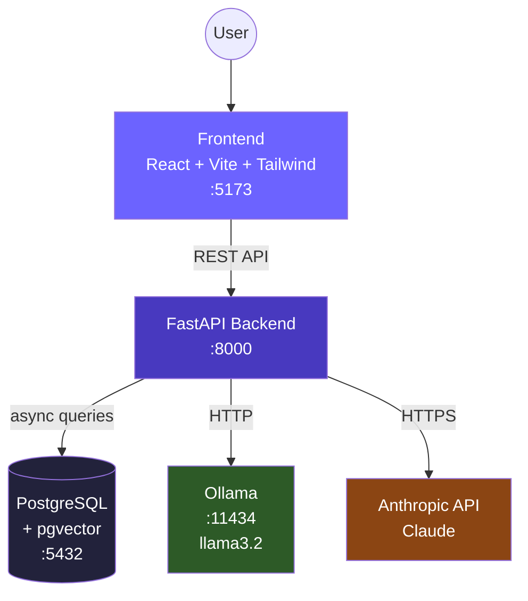
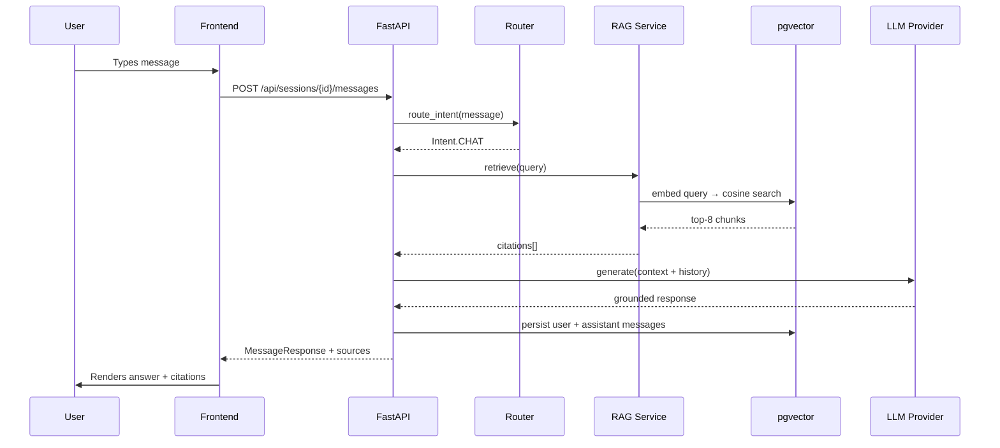
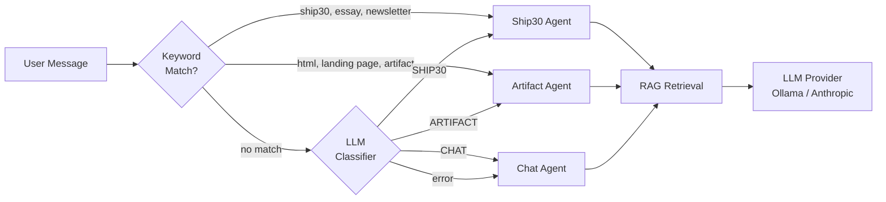
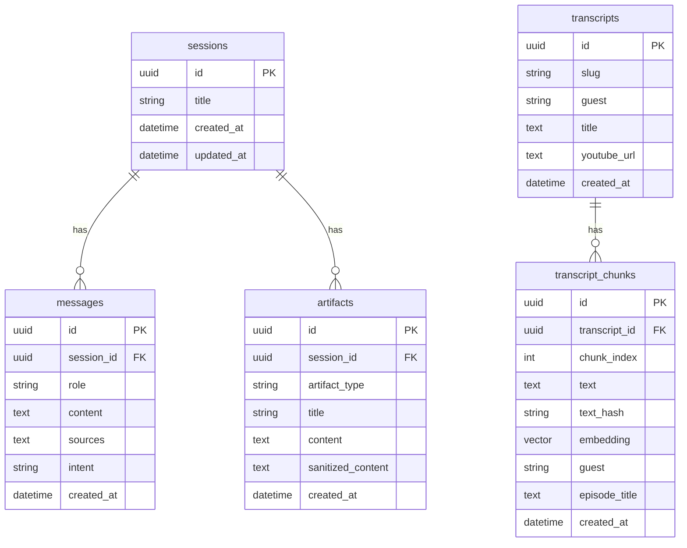
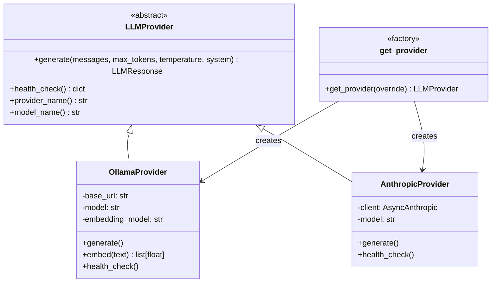
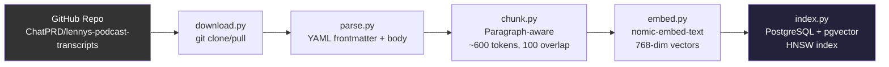
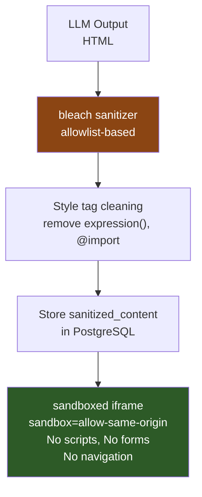

# Architecture: Lenny Growth Assistant

## System Overview

## Request Flow — Chat Query

## Agent Routing

## Database Schema

## LLM Provider Abstraction

## Ingestion Pipeline

## Security Architecture

## Key Design Decisions

### 1. Paragraph-Aware Chunking
Instead of fixed-character splitting, we split on paragraph boundaries and speaker turns. This preserves conversational context and produces semantically coherent chunks that retrieve better.

### 2. nomic-embed-text for Embeddings
- 768-dimension vectors (vs. 1536 for OpenAI text-embedding-3-small)
- Runs locally via Ollama — no external API dependency for embeddings
- High quality: trained on diverse text including conversational transcripts

### 3. HNSW Index
pgvector's HNSW (Hierarchical Navigable Small World) index provides O(log n) approximate nearest neighbor search. With m=16 and ef_construction=64, it balances recall quality with index build time.

### 4. Intent Router — Keyword + LLM Fallback
The keyword pre-check catches obvious cases (essay, ship30, html) without an LLM call. For ambiguous cases, a cheap 10-token LLM call classifies intent. This keeps routing fast and predictable.

### 5. Anti-Hallucination System Prompt
The chat agent's system prompt explicitly instructs the LLM to:
- Only cite what's in the retrieved context
- Use exact attribution format
- Respond with an insufficient-evidence message when context is absent
- Distinguish inference from retrieved evidence

### 6. HTML Sandbox Security Layers
HTML artifacts go through two security layers:
1. **Server-side**: `bleach` allowlist sanitizer strips scripts, event handlers, and dangerous protocols
2. **Client-side**: Sandboxed iframe with `sandbox="allow-same-origin"` — blocks JS execution even if sanitizer misses something

## Performance Characteristics

| Operation | Typical Time |
|---|---|
| Query embedding (nomic-embed-text) | 50–200ms |
| pgvector HNSW search (20k chunks) | <5ms |
| Ollama llama3.2 response (1500 tokens) | 10–60s (hardware dependent) |
| Anthropic claude-3-5-haiku response | 2–8s |
| Full request round-trip (Ollama) | 15–65s |
| Full request round-trip (Anthropic) | 3–10s |
